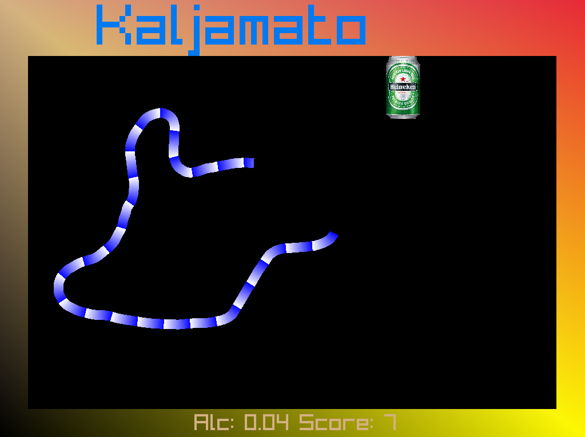

# Kaljamato

Kaljamato is beer worm game. Kaljamato's idea is based on old [beerworm](https://www.jonneweb.net/pelit/file/873/beerworm/) dos game. Idea is to
 to collect beers. On each beer worm becomes more drunk and does not move anymore in straight line. Drunkness can be zeroed by collecting medkit when it appears. 

This is my first experience in zig language. This game is still in early prototype phase, some refactoring is needed. Goal was to test how well zig can interact with c libraries. (no wrapper neede for [raylib](https://www.raylib.com/))

## Building

After cloning
~~~
cd beerworm
git submodule update --init --recursive
~~~

Zig software can be runned and built as normal zig software
~~~sh
zig build run
~~~

It is also possible to cross compile to windows
~~~sh
zig build -Dtarget=x86_64-windows
~~~

## Usage

Beerworm executable have all media files compiled in.

Game have following key mappings

| Key   | function   |
|-------|------------|
| left  | turn left  |
| right | turn right |
|   P   | pause |
|   F   | toggle fullscreen |

Executable have command line option to change game settings

Like

~~~sh
./kaljamato -w=800 -h=600
~~~

Settings are just for testing new default settings for next version

| flag |    variable     | default | explanation |
|------|-----------------|---------|-------------|
|-w    |screen_width     |1024     |horisontal resolution in pixels|
|-h    |screen_height    |768      |vertical resolutio|
|-i    |lengthIncPerBeer |80       | on each beer grow this number of pixels|
|-ms   |sideMarginPixels |50       | number of pixels on side border|
|-mt   |topMarginPixels  |100      | number of pixel on header bar |
|-mb   |bottomMarginPixels|50      | number of pixels on footer |
|-fb   |bottomFontSize   |40       | font size on bottom |
|-ft   |topFontSize      | 100     | title font size |
|-b    |beerWidthPixels  | 60      | width of beers in pixels |
|-ws   |wormspeed        | 1.85    | how many pixels per frame movement|
|-wt   |wormturnstep     | 0.04    | radians turn per frame |
|-ww   |wormwidth        | 17      | worm width in pixels |
|-d    |drunknessFactor  | 6       | drunkness factor how fast alchol hits|
|-kt   |medkitVisibleTime| 8000    | how many milliseconds medkit is visible |
|-kp   |medkitProbpability| 0.3    | propability 1.0-0.0 to medkit appear on beer consume event |